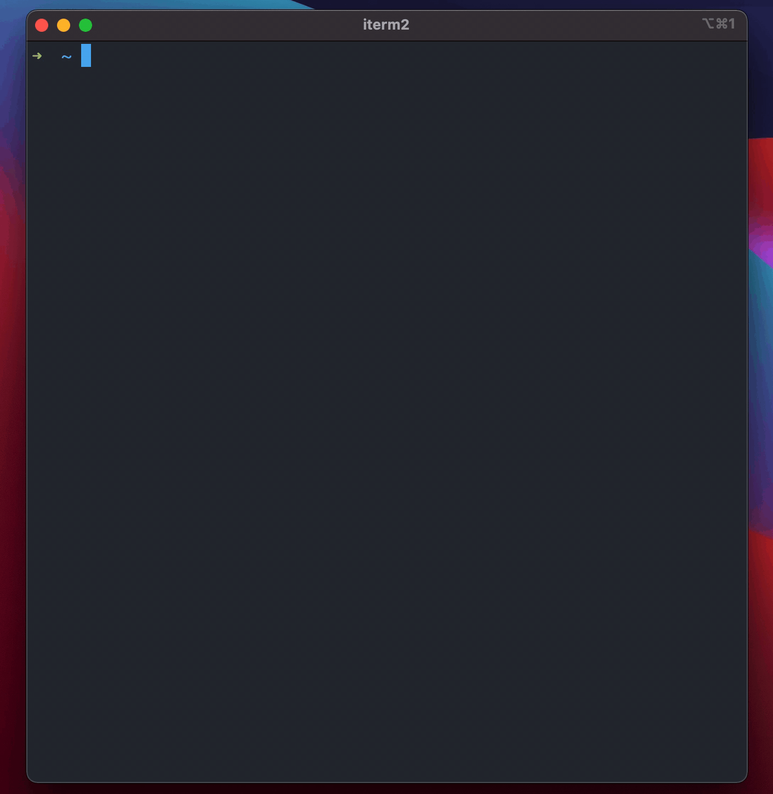

# stbb: Simple Terminal Blackboard

A terminal GUI application for writing on a rectangular surface (the terminal) with no distractions.

Unlike a traditional text editor that works with files composed of lines, each with certain length, stbb works directly with the 2d grid given by the terminal cells and nothing else. It also doesn't save the content, not even in memory. It prints it straight to the terminal window. This way, it's more like a blackboard meant to be erased than a document meant to be saved.

This application is mostly a toy, but the repo can serve as a starting point for building a text editor, dev tool, midi editor, game prototype, or something else. The key idea is that dev tools are easy to make when the target audience is small.

## Install

Install [cargo](https://doc.rust-lang.org/cargo/getting-started/installation.html), download the source code and type `cargo install --path .` at the root of this repository. Then type `stbb` to start the program.

## Contributing
Rust tips and tricks appreciated (this is my first Rust project). Bug reports (via github issue) and bug fixes (via pull request) are welcome. Feature requests (via github issue) are welcome, though I can't promise anything. Don't email me or any other contributor without explicit permission.

## Demo

